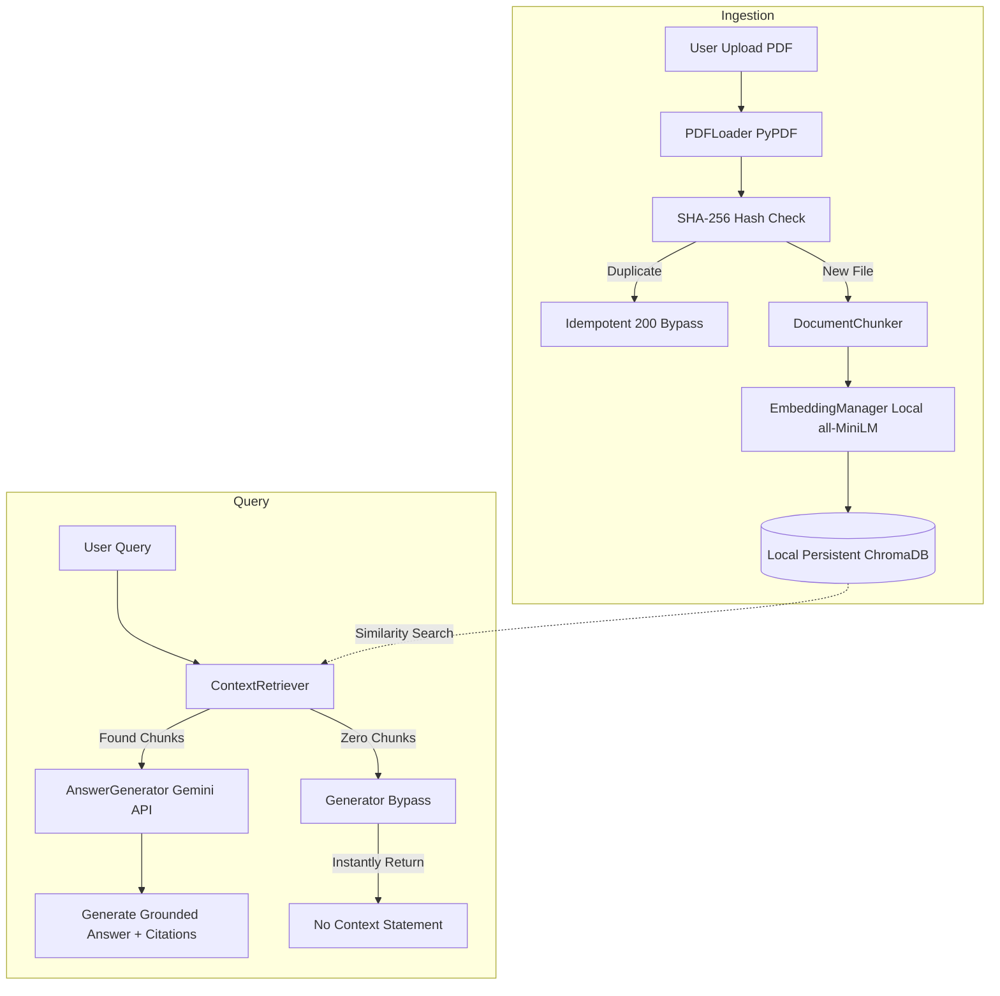

# Cost-Efficient local RAG Application

A production-ready, highly modular, and cost-efficient Retrieval-Augmented Generation (RAG) backend API built with FastAPI, local persistent ChromaDB, Sentence Transformers (`all-MiniLM-L6-v2`), and Google Gemini.

Designed for take-home assignment specifications, this project is engineered to provide local semantic search over a document corpus with zero vector host billing, honest citations, and optimized model spend.

---

## 🏗️ Architecture Workflow



---

## 🛠️ Tech Stack & Optimization Details

1. **FastAPI & Uvicorn**: High-performance, fully validated asynchronous routing API.
2. **Local ChromaDB Persistence**: Keeps SQLite-backed vector search entirely on-premise, avoiding pricey monthly charges for hosted cloud databases.
3. **Local SentenceTransformers (`all-MiniLM-L6-v2`)**: Generates embeddings locally without network dependencies, rate-limiting, or token generation charges.
4. **Google Gemini (`gemini-1.5-flash`)**: Multi-modal reasoning engine utilized with zero-temperature instructions for grounded generation.
5. **Cost-Saving Short-Circuiting**: Queries with empty search contexts immediately bypass the remote Gemini API, returning standard grounding fallbacks to save API tokens.

---

## 📦 Setup & Installation

### Prerequisite: Install official Python runtime
To run the vector store database successfully without source compilation errors on Windows:
1. Ensure the **Official Microsoft Windows Python 3.11** or **3.12** is installed (avoid MSYS2/MinGW default compilation paths).
2. Install via winget:
   ```powershell
   winget install Python.Python.3.11
   ```
3. Open a new terminal session.

### Step 1: Clone and configure
Clone this repository and create a virtual environment in the project directory:
```powershell
python -m venv venv
.\venv\Scripts\Activate.ps1
```

### Step 2: Install dependencies
Upgrade pip and install requirements:
```powershell
python -m pip install --upgrade pip
pip install -r requirements.txt
```

### Step 3: Configure Environment Variables
Copy `.env.example` to `.env`:
```powershell
copy .env.example .env
```
Open `.env` and fill in your **Google Gemini API Key**:
```env
GEMINI_API_KEY=your_actual_gemini_api_key_here
CHROMA_DB_PATH=chroma_db
LOG_LEVEL=INFO
```

---

## 🚀 How to Run

Start the ASGI backend server:
```powershell
uvicorn app.main:app --reload
```
Once started, the API is available locally:
* **API Server**: [http://localhost:8000](http://localhost:8000)
* **Interactive Swagger Documentation**: [http://localhost:8000/docs](http://localhost:8000/docs)
* **ReDoc Alternatives**: [http://localhost:8000/redoc](http://localhost:8000/redoc)

---

## 📡 API Reference & Endpoints

### 1. Welcome Greeting
* **Method**: `GET`
* **Path**: `/`
* **Response**:
  ```json
  {
    "message": "Welcome to the Cost-Efficient RAG Application API. Go to /docs for Swagger."
  }
  ```

### 2. Health check Probe
* **Method**: `GET`
* **Path**: `/health`
* **Response**:
  ```json
  {
    "status": "ok",
    "environment": "running",
    "database_connected": true
  }
  ```

### 3. Ingest PDF Document
* **Method**: `POST`
* **Path**: `/upload`
* **Content-Type**: `multipart/form-data`
* **Parameters**:
  * `file`: (Required) Binary PDF file.
  * `chunk_size`: (Optional Form Integer) e.g., `500`
  * `chunk_overlap`: (Optional Form Integer) e.g., `50`
* **Features**:
  * **Idempotency**: Computes file SHA-256. Re-uploading identical documents instantly returns the existing schema.
* **Response (New upload)**:
  ```json
  {
    "message": "Document uploaded and processed successfully.",
    "document_id": "4a7b8c...",
    "filename": "annual_report.pdf",
    "total_chunks": 12,
    "file_hash": "4a7b8c..."
  }
  ```

### 4. Query RAG System
* **Method**: `POST`
* **Path**: `/query`
* **Content-Type**: `application/json`
* **Payload**:
  ```json
  {
    "question": "What were the financial earnings in page 3?",
    "top_k": 3,
    "metadata_filter": {
      "filename": "annual_report.pdf"
    }
  }
  ```
* **Response**:
  ```json
  {
    "answer": "The financial earnings stated on page 3 were $4.2M.",
    "citations": [
      {
        "filename": "annual_report.pdf",
        "page": 3,
        "text": "In Q3, standard operating margins showed a total revenue profit scale of $4.2M."
      }
    ],
    "latency_ms": 320.15
  }
  ```

### 5. List Ingested Documents
* **Method**: `GET`
* **Path**: `/documents`
* **Response**:
  ```json
  {
    "documents": [
      {
        "document_id": "4a7b8c...",
        "filename": "annual_report.pdf",
        "file_hash": "4a7b8c...",
        "total_chunks": 12,
        "upload_time": "2026-07-17T12:00:00.000Z"
      }
    ]
  }
  ```

### 6. Delete Document
* **Method**: `DELETE`
* **Path**: `/documents/{document_id}`
* **Response**:
  ```json
  {
    "message": "Successfully deleted document ID '4a7b8c...' and all associated vector chunks.",
    "success": true
  }
  ```

---

## 📈 Cost Analysis: Managed vs. Local Embedded DB

| Metric / Dimension | Managed Vector Database (e.g. Pinecone/Qdrant Cloud) | This Local RAG Architecture (ChromaDB Local) |
| :--- | :--- | :--- |
| **Always-on Host Cost** | ~$30 - $70 / Month (minimum pod hosting) | **$0 / Month** (embedded inside process RAM) |
| **Ingestion Cost** | API billing + remote write latencies | **$0 / Month** (local writes) |
| **Embedding Generation** | ~$0.0001 per 1K tokens (Remote API) | **$0 / Month** (local cpu/gpu generation) |
| **LLM Call Costs** | Full price per token query | **Optimized** (Short-circuits empty queries to $0) |
| **Scalability Limit** | Bound by purchased cloud subscription sizes | Bound only by disk storage space |

---

## 🛡️ Exception & Error Safety

* **HTTP 422 (Schema Validation)**: Handles structured parameter exceptions (returning descriptive lists of errors).
* **HTTP 409 (Deduplication Check)**: Detects duplicate upload requests gracefully, providing existing document maps instead of cluttering DB tables.
* **HTTP 500 (Internal Server Error)**: Implements custom global handler that logs stacks securely in files while sending friendly, leak-free messages to client APIs.
* **LOGGING**: Fully outputs running info to `logs/app.log` structured as:
  `[timestamp] LEVEL [name:filename:line] message`
